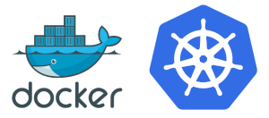

<p align="center">
<h2>Kubernetes y Docker en AWS</h2>
</p>
<p align="center">
  
</p>

- [NOTAS](#notas)
- [Guía de redes de Kubernetes para principiantes](#guía-de-redes-de-kubernetes-para-principiantes)
  - [Comunicación entre contenedores en el mismo pod](#comunicación-entre-contenedores-en-el-mismo-pod)
  - [¿Qué es un espacio de nombres de red?](#qué-es-un-espacio-de-nombres-de-red)
  - [Comunicación entre pods en el mismo nodo](#comunicación-entre-pods-en-el-mismo-nodo)
  - [¿Qué es un puente de red?](#qué-es-un-puente-de-red)
  - [Comunicación entre pods en diferentes nodos](#comunicación-entre-pods-en-diferentes-nodos)
  - [Comunicación entre pods y servicios](#comunicación-entre-pods-y-servicios)
  - [¿Cómo funciona el DNS? ¿Cómo descubrimos las direcciones IP?](#cómo-funciona-el-dns-cómo-descubrimos-las-direcciones-ip)
- [Debugear docker](#debugear-docker)
- [Instalacion de Docker](#instalacion-de-docker)
  - [Crear un grupo y usuario para el docker](#crear-un-grupo-y-usuario-para-el-docker)
- [Instalacion de Kubernet](#instalacion-de-kubernet)
- [Instalacion de miniKube](#instalacion-de-minikube)
- [Que no es docker](#que-no-es-docker)
- [Comandos Docker](#comandos-docker)
  - [Creando una imagen](#creando-una-imagen)
  - [Exponer un puerto desde el Dockerfile](#exponer-un-puerto-desde-el-dockerfile)
  - [Construyendo la IMAGEN](#construyendo-la-imagen)
  - [Borrar una imagen](#borrar-una-imagen)
  - [Obtener la ip de un contenedor desde inspect](#obtener-la-ip-de-un-contenedor-desde-inspect)
  - [crear un contenedor publicando un puerto especifico](#crear-un-contenedor-publicando-un-puerto-especifico)
  - [crear un contenedor publicando un puerto especifico en un interfaz concreto](#crear-un-contenedor-publicando-un-puerto-especifico-en-un-interfaz-concreto)
  - [crear la nueva imagen](#crear-la-nueva-imagen)
  - [taguear como latest](#taguear-como-latest)
  - [crear un contenedor publicando a un puerto local expuesto en la imagen](#crear-un-contenedor-publicando-a-un-puerto-local-expuesto-en-la-imagen)
  - [Crear contenedor y arrancarlo a la vez en segundo plano con un solo comando](#crear-contenedor-y-arrancarlo-a-la-vez-en-segundo-plano-con-un-solo-comando)
  - [Comprobar rango de puertos locales](#comprobar-rango-de-puertos-locales)
  - [Instalar terminator](#instalar-terminator)
  - [Crear nueva division horizontal en terminator](#crear-nueva-division-horizontal-en-terminator)
  - [crear contenedor](#crear-contenedor)
  - [Algunos ejemplos de ejecutar comandos dentro del contenedor con exec](#algunos-ejemplos-de-ejecutar-comandos-dentro-del-contenedor-con-exec)
  - [Ejecutar la shell bash dentro de un contenedor que esta corriendo](#ejecutar-la-shell-bash-dentro-de-un-contenedor-que-esta-corriendo)
  - [Ver logs de nginx dentro del contenedor](#ver-logs-de-nginx-dentro-del-contenedor)
  - [listar volumenes](#listar-volumenes)
  - [Crear volumen](#crear-volumen)
  - [Inspeccionar volumen](#inspeccionar-volumen)
  - [crear contenedor con volumen persistente](#crear-contenedor-con-volumen-persistente)
  - [eliminar un volumen](#eliminar-un-volumen)
  - [limpiar o purgar el listado de volumenes no utilizados](#limpiar-o-purgar-el-listado-de-volumenes-no-utilizados)
  - [listar redes](#listar-redes)
  - [Crear network](#crear-network)
  - [Crear un contenedor dentro de una red](#crear-un-contenedor-dentro-de-una-red)
  - [filtrar ip en la salida de docker inspect](#filtrar-ip-en-la-salida-de-docker-inspect)
  - [eliminar las redes que no esten en uso](#eliminar-las-redes-que-no-esten-en-uso)
  - [conectar y desconectar un contenedor de una red](#conectar-y-desconectar-un-contenedor-de-una-red)
  - [docker login](#docker-login)
  - [etiquetar imagen](#etiquetar-imagen)
  - [subir imagen](#subir-imagen)
  - [descargar imagen](#descargar-imagen)
  - [eliminar todas las imagenes](#eliminar-todas-las-imagenes)
  - [eliminat todos los contenedores](#eliminat-todos-los-contenedores)
  - [Leer variables de entorno](#leer-variables-de-entorno)
  - [leer contenido de la variable de entorno SHELL](#leer-contenido-de-la-variable-de-entorno-shell)
  - [crear contenedor inyectando variables de entorno](#crear-contenedor-inyectando-variables-de-entorno)
  - [siempre tagear las imagaenes](#siempre-tagear-las-imagaenes)
- [Docker compose](#docker-compose)
  - [Levantar contenedor o contenedores definidos con docker compose en primer plano](#levantar-contenedor-o-contenedores-definidos-con-docker-compose-en-primer-plano)
  - [Levantar contenedor o contenedores definidos con docker compose en segundo plano](#levantar-contenedor-o-contenedores-definidos-con-docker-compose-en-segundo-plano)
  - [Parar contenedores definidos con docker compose](#parar-contenedores-definidos-con-docker-compose)
  - [Eliminar contendores creados con docker compose](#eliminar-contendores-creados-con-docker-compose)
  - [ver los logs](#ver-los-logs)
  - [Construir imagen a traves de docker-compose](#construir-imagen-a-traves-de-docker-compose)
- [Pasarle archivos al docker](#pasarle-archivos-al-docker)
  - [Parte 1](#parte-1)
  - [Crear network](#crear-network-1)
  - [Crear contenedor de pruebas con mariadb:latest1](#crear-contenedor-de-pruebas-con-mariadblatest1)
  - [Conectarnos al contenedor y comprobar la variable de entorno](#conectarnos-al-contenedor-y-comprobar-la-variable-de-entorno)
    - [Conectarnos a mysql y listar bases de datos](#conectarnos-a-mysql-y-listar-bases-de-datos)
    - [conectar a la base de datos desde otro contenedor y listar bases de datos](#conectar-a-la-base-de-datos-desde-otro-contenedor-y-listar-bases-de-datos)
    - [Importamos la base de datos](#importamos-la-base-de-datos)
    - [conectar a la base de datos desde otro contenedor y listar los cambios](#conectar-a-la-base-de-datos-desde-otro-contenedor-y-listar-los-cambios)
  - [Parte 2](#parte-2)
  - [Crear la imagen de nuestra aplicacion](#crear-la-imagen-de-nuestra-aplicacion)
  - [Ejecutar nuestra imagen](#ejecutar-nuestra-imagen)
  - [Conectamos a la base de datos e insertamos nuevos datos](#conectamos-a-la-base-de-datos-e-insertamos-nuevos-datos)
- [miniKube install with virtualbox](#minikube-install-with-virtualbox)
  - [Comandos minikube](#comandos-minikube)
  - [configuraciones](#configuraciones)
  - [Troubleshootinde del cluster con Minikube](#troubleshootinde-del-cluster-con-minikube)
  - [Plugins de minikube (addons)](#plugins-de-minikube-addons)
- [Kubectl](#kubectl)
  - [comandos](#comandos)
  - [Manifests VS Linea de comandos](#manifests-vs-linea-de-comandos)
    - [Implementacion de manifests](#implementacion-de-manifests)
    - [Borrar Manifests](#borrar-manifests)
    - [Comandos Con manifest](#comandos-con-manifest)
    - [Comandos Sin manifest](#comandos-sin-manifest)
  - [Pods](#pods)
    - [Ejemplo de post con manisfest](#ejemplo-de-post-con-manisfest)
  - [Metadata, Labels y Selectors](#metadata-labels-y-selectors)
  - [comandos selectors](#comandos-selectors)
- [Replication controlers](#replication-controlers)
- [replicaset](#replicaset)
- [Servicios](#servicios)
- [Persisten volume](#persisten-volume)
- [ConfigMaps](#configmaps)
  - [Creando un configMap desde la linea de comandos](#creando-un-configmap-desde-la-linea-de-comandos)
- [Secrets](#secrets)
  - [comandos](#comandos-1)
  - [tipos](#tipos)
- [Deployments](#deployments)
  - [Comandos](#comandos-2)
    - [Available Commands for rolout](#available-commands-for-rolout)
    - [desplegando una imagen](#desplegando-una-imagen)
    - [Volver a una version anterior](#volver-a-una-version-anterior)
- [Namespaces](#namespaces)
  - [Comandos](#comandos-3)
  - [Creacion de un namespace](#creacion-de-un-namespace)
  - [Crear un pot dentro del namespace](#crear-un-pot-dentro-del-namespace)
- [Kubernetes en AWS con Kops](#kubernetes-en-aws-con-kops)
  - [Instalacion en Linux](#instalacion-en-linux)
  - [Comandos](#comandos-4)
- [EKS](#eks)
  - [comandos](#comandos-5)
  - [pod affinity](#pod-affinity)
  - [pod antiaffinity](#pod-antiaffinity)
  - [EKSCTL](#eksctl)
    - [comandos](#comandos-6)
- [Fargate](#fargate)
- [Annotations](#annotations)
- [CURSO PLATZI](#curso-platzi)
  - [Repaso de contenedores e introducción a k8s](#repaso-de-contenedores-e-introducción-a-k8s)
  - [De pods a contenedores](#de-pods-a-contenedores)
    - [Docker & Kubernetes](#docker--kubernetes)
    - [Kubernetes en la práctica](#kubernetes-en-la-práctica)
  - [Arquitectura de K8s](#arquitectura-de-k8s)
    - [Nodo Master](#nodo-master)
    - [Tipos de controller manager](#tipos-de-controller-manager)
    - [Componentes muy importantes que viven en los nodos:](#componentes-muy-importantes-que-viven-en-los-nodos)
  - [Modelos declarativos e imperativos](#modelos-declarativos-e-imperativos)
    - [Imperativo](#imperativo)
    - [Declarativo](#declarativo)
  - [Visión general del modelo de red](#visión-general-del-modelo-de-red)
  - [Kubectl](#kubectl-1)
  - [comandos](#comandos-7)
  - [Deployments y replica sets](#deployments-y-replica-sets)
  - [Accediendo a nuestros PODS a través de servicios](#accediendo-a-nuestros-pods-a-través-de-servicios)
  - [Enrutando el tráfico utilizando servicios](#enrutando-el-tráfico-utilizando-servicios)
  - [Desplegando nuestra app en k8s](#desplegando-nuestra-app-en-k8s)
    - [Exponer un puerto en el node](#exponer-un-puerto-en-el-node)
  - [Exponiendo servicios interna y externamente (kubectl-proxy)](#exponiendo-servicios-interna-y-externamente-kubectl-proxy)
  - [Despliegues controlados](#despliegues-controlados)
    - [Comandos](#comandos-8)
  - [cambiar el editor de kubectl](#cambiar-el-editor-de-kubectl)
  - [Healthchecks](#healthchecks)
  - [Gestionar stacks con Helm](#gestionar-stacks-con-helm)
  - [Gestionando la configuración aplicativas utilizando Config Maps](#gestionando-la-configuración-aplicativas-utilizando-config-maps)
  - [Volumenes](#volumenes)
  - [Introducción a namespaces](#introducción-a-namespaces)
  - [Setear contexto para usar un namespace diferente](#setear-contexto-para-usar-un-namespace-diferente)
  - [Crear un namespace](#crear-un-namespace)
  - [crear app en un namespace](#crear-app-en-un-namespace)
  - [crear servicio](#crear-servicio)
  - [Autenticación y autorización](#autenticación-y-autorización)
  - [Service account tokens](#service-account-tokens)
  - [RBAC](#rbac)
    - [Role and ClusterRole](#role-and-clusterrole)
    - [RoleBinding and ClusterRoleBinding](#rolebinding-and-clusterrolebinding)
  - [Recomendaciones para implementar Kubernetes en tu organización o proyectos](#recomendaciones-para-implementar-kubernetes-en-tu-organización-o-proyectos)
- [GitOps](#gitops)

# NOTAS

Comandos para comprobar las extensiones de virtualizacion:

```cat /proc/cpuinfo| egrep "vmx|svm"```

Enlaces de instalacion:

```url
https://docs.docker.com/install/linux/docker-ce/ubuntu/

https://kubernetes.io/docs/tasks/tools/install-kubectl/

https://kubernetes.io/docs/tasks/tools/install-minikube/

https://docs.docker.com/compose/install/

https://docs.aws.amazon.com/cli/latest/userguide/install-cliv2.html

```

# Guía de redes de Kubernetes para principiantes

Hay cinco cosas esenciales que debe comprender sobre las redes en Kubernetes

Comunicación entre contenedores en el mismo pod
Comunicación entre pods en el mismo nodo
Comunicación entre pods en diferentes nodos
Comunicación entre pods y servicios
¿Cómo funciona el DNS? ¿Cómo descubrimos las direcciones IP?

<p align="center">
  
</p>

## Comunicación entre contenedores en el mismo pod

Primero, si tiene dos contenedores ejecutándose en el mismo pod, ¿cómo se comunican entre sí?

Esto sucede a través de localhosty números de puerto. Al igual que cuando ejecuta varios servidores en su propia computadora portátil.

Esto es posible porque los contenedores en el mismo pod están en el mismo espacio de nombres de red: comparten recursos de red.

## ¿Qué es un espacio de nombres de red?
Es una colección de interfaces de red (conexiones entre dos equipos en una red) y tablas de enrutamiento (instrucciones sobre dónde enviar paquetes de red).

Los espacios de nombres son útiles porque puede tener muchos espacios de nombres de red en la misma máquina virtual sin colisiones ni interferencias.

(No querrá que todos sus pods ejecuten contenedores que escuchen en el puerto 3000 en el mismo espacio de nombres; ¡todos colisionarían!)

Hay un contenedor secreto que se ejecuta en cada pod de Kubernetes. El trabajo n. ° 1 de este contenedor es mantener abierto el espacio de nombres en caso de que todos los demás contenedores del pod mueran. Se llama `pause` contenedor.

Entonces, cada pod tiene su propio espacio de nombres de red. Los contenedores del mismo pod están en el mismo espacio de nombres de red. Es por eso que puede hablar entre contenedores a través de localhost y por qué debe estar atento a los conflictos de puertos cuando tiene varios contenedores en el mismo pod.

<p align="center">
  
</p>

## Comunicación entre pods en el mismo nodo

Cada pod de un nodo tiene su propio espacio de nombres de red. Cada pod tiene su propia dirección IP.

Y cada pod piensa que tiene un dispositivo Ethernet totalmente normal llamado `eth0` para realizar solicitudes de red. Pero Kubernetes lo está fingiendo: es solo una conexión Ethernet virtual.

El `eth0` de cada pod está realmente conectado a un dispositivo ethernet virtual en el nodo.

Un dispositivo ethernet virtual es un túnel que conecta la red del pod con el nodo. Esta conexión tiene dos lados: en el lado de la vaina, se llama `eth0`, y en el lado del nodo, se llama `vethX`.

¿Por qué el X? Hay una `vethX` conexión para cada pod del nodo. (Así que estarían `veth1`, `veth2`, `veth3`, `etc`.)

Cuando un pod realiza una solicitud a la dirección IP de otro nodo, realiza esa solicitud a través de su propia `eth0` interfaz. Esto hace un túnel a la `vethX` interfaz virtual respectiva del nodo .

Pero entonces, ¿cómo llega la solicitud al otro grupo?

El nodo usa un puente de red.

## ¿Qué es un puente de red?

Un puente de red conecta dos redes juntas. Cuando una solicitud llega al puente, el puente pregunta a todos los dispositivos conectados (es decir, pods) si tienen la dirección IP correcta para manejar la solicitud original.

(Recuerde que cada pod tiene su propia dirección IP y conoce su propia dirección IP).

Si uno de los dispositivos lo hace, el puente almacenará esta información y también reenviará los datos al respaldo original para que se complete su solicitud de red.

En Kubernetes, este puente se llama `cbr0`. Cada pod de un nodo es parte del puente y el puente conecta todos los pods del mismo nodo.

<p align="center">
  
</p>

## Comunicación entre pods en diferentes nodos

Pero, ¿qué pasa si las vainas están en diferentes nodos?

Bueno, cuando el puente de red pregunta a todos los dispositivos conectados (es decir, pods) si tienen la dirección IP correcta, ninguno de ellos dirá que sí.

(Tenga en cuenta que esta parte puede variar según el proveedor de la nube y los complementos de red).

Después de eso, el puente vuelve a la puerta de enlace predeterminada. Esto sube al nivel de clúster y busca la dirección IP.

A nivel de clúster, hay una tabla que asigna rangos de direcciones IP a varios nodos. A los pods en esos nodos se les habrán asignado direcciones IP de esos rangos.

Por ejemplo, podría dar Kubernetes vainas en el nodo 1 como direcciones `100.96.1.1`, `100.96.1.2` etc. Y Kubernetes da vainas en el nodo `2` direcciones como `100.96.2.1`, `100.96.2.2` y así sucesivamente.

Entonces, esta tabla almacenará el hecho de que las direcciones IP que parecen `100.96.1.xxx` deben ir al nodo 1, y las direcciones como `100.96.2.xxx` deben ir al nodo 2.

Una vez que hayamos descubierto a qué nodo enviar la solicitud, el proceso procede aproximadamente de la misma manera que si los pods hubieran estado en el mismo nodo todo el tiempo.

<p align="center">
  
</p>

## Comunicación entre pods y servicios

Un último patrón de comunicación es importante en Kubernetes.

En Kubernetes, un servicio le permite asignar una única dirección IP a un conjunto de pods. Realiza solicitudes a un punto final (nombre de dominio / dirección IP) y el servicio envía solicitudes a un pod en ese servicio.

Esto sucede a través de `kube-proxy` un pequeño proceso que Kubernetes ejecuta dentro de cada nodo.

Este proceso asigna direcciones IP virtuales a un grupo de direcciones IP de pod reales.

Una vez que se `kube-proxy` ha asignado la IP virtual del servicio a una IP de pod real, la solicitud procede como en las secciones anteriores.

## ¿Cómo funciona el DNS? ¿Cómo descubrimos las direcciones IP?

DNS es el sistema para convertir nombres de dominio a direcciones IP.

Los clústeres de Kubernetes tienen un servicio responsable de la resolución de DNS.

A cada servicio de un clúster se le asigna un nombre de dominio como `my-service.my-namespace.svc.cluster.local.`

Los pods reciben automáticamente un nombre `DNS` y también pueden especificar el suyo propio mediante las propiedades `hostname` y `subdomain` en su configuración YAML.

Entonces, cuando se realiza una solicitud a un servicio a través de su nombre de dominio, el servicio DNS lo resuelve en la dirección IP del servicio.

Luego, `kube-proxy` convierte la dirección IP de ese servicio en una dirección IP de pod. Después de eso, en función de si los pods están en el mismo nodo o en nodos diferentes, la solicitud sigue una de las rutas explicadas anteriormente.
# Debugear docker

1. Find out if the Docker daemon is running

Since I am running on Ubuntu, I built this VM to use Upstart as the boot time start mechanism. This means I need to use it’s utilities to check the status:

> ```sudo status docker```

docker start/running, process 2841

so far so good;

2. Start your container, see if it’s running.

> ```sudo docker start xxx``` (where ‘xxx’ are there first 3 characters of the docker container)

> ```sudo docker ps```

When I did this, nothing was listed..

CONTAINER ID IMAGE COMMAND CREATED STATUS PORTS NAMES

jenkinsadmin@ubuntu:~/jenkins-data$

so that tells me the container didnt start correctly. Then I did a

> ```sudo docker ps -a```

now i see my container:

CONTAINER ID IMAGE COMMAND CREATED STATUS PORTS NAMES

6a721ae2d232 myjenkinsdata “echo ‘Data container” 4 weeks ago Exited (0) About an hour ago jenkins-data

under the STATUS column, I see it is “Exited”. Not good.

3. Check the container log

> ```sudo docker logs xxx```

where ‘xxx’ are the first three characters of the container. This should show you any message output during container initialization. In my case, it was

jenkinsadmin@ubuntu:~$ sudo docker logs 6a7

[sudo] password for jenkinsadmin:
Data container for Jenkins

this “data container for jenkins” message corresponds to the final entry in my Dockerfile,

CMD [“echo”, “Data container for Jenkins”]

that at least told me the commands in the Dockerfile were executing.

4. Commit the container changes to a new image

The idea here is that if there is corruption in the container, you can determine whether the image itself is also at fault by committing the changes (to a new image) and creating a new container from that new image.

>docker commit –change “debug container vs image” xxxxxxxxx `<repo>/<image>:<version>` where ‘xxxxxxxxxxx’ is the container id.

now you can execute the “docker run” command (as you did originally to create the container you are trying to debug)

# Instalacion de Docker

El enlace de la docuementacion de docker es
<https://docs.docker.com/engine/install/ubuntu/>

Borrar cualquier version que tuviecemos instalada
```sudo apt-get remove docker docker-engine docker.io containerd runc```

## Crear un grupo y usuario para el docker

Este comando debe correrce en el root,  y debemos asiganar en user el usuario que deseamos agregar al grupo llamado docker
```usermod -a -G docker user```

# Instalacion de Kubernet

<https://kubernetes.io/docs/tasks/tools/install-kubectl/>

Dar permiso de ejecucion al archivo descargado
```chmod u+x kubectl```
Moveremos el archivo a los binarios
```sudo mv kubectl /usr/local/bin```

# Instalacion de miniKube

<https://kubernetes.io/docs/tasks/tools/install-minikube/>

Igualmente lo movemos a user local bin
```sudo mv minikube /usr/local/bin```

# Que no es docker

- NO es Gestor de entorno virtuales de desarrollo (vagrant)
- NO es Un software de vistulizacion
- NO es Un gestor de configuracion
- NO es  Un software de contenedores

Es un ecosistrma basado en un software del mismo nombre, donde podemos gestionar contenedores y sus imaganes, ademas de compartirlas

Software para montar entornos de desarrollo, un aherramienta para jcutar aplicaciones aislandolas de otras, algo para ejcutar exactamente los mismo en varios entornos, etc. Permite evitar el overhead.

Se maneja por capaz lo que agiliza y optimiza los recursos.
por ejemplo en la primera capa instalamos un apache, nuestra imagen 1.0 y luego instalamos un git, ```git``` caeria en la sobre la capa de apache resultando una imagen 1.1, sin reescribir la capa 1.

# Comandos Docker

<https://docs.docker.com/engine/reference/commandline/docker/>

- ```docker images```:    Lista las imagenes que tenemos almacenadas en la cache.
- ```docker build RUTA```:  Construye la imagen  apartir de nuestro archivo Dockerfile
- ```docker image rm ID-IMAGEN```: Borrar una imagen docker
- ```docker build -t tagName:tagValue .``` : Para ponerle etiquetas a nuestas imagenes, sirve para versionar las imaganes
- ```docker tag helloworld:1.0 helloworld:lastest``` : Reetiquetar para indicarle que esta version es la ultima. Etiquetar la imagen como latest
- ```docker inspect idIMAGE```: Conocer los metadatos de las imagenes
- ```docker inspect helloworld:lastest```: Otra manera de ver los metadatos
- ```docker create helloworld``` o ```docker create helloworld:etiqueta``` : crear un contenedor
- ```docker ps```: listar contenedores en ejecucion
- ```docker ps -a```: listar contenedores (incluso parados)
- ```docker rm ID_parcial```, ```docker rm ID```, ```docker rm name```: eliminar contenedores
- ```docker start name``` : Iniciar o arrancar un contenedor ya creado
- ```sudo docker exec -it ID bash```: run de docker
- ```docker stop name```: parar un contenedor ya creado y arrancado
- ```docker rm name -f```: eliminar un contenedor que esta corriendo
- ```docker create --name web01 helloworld:latest``` : crear un container con nombre
- ```docker inspect web01```: Inspeccionar contenedor
- ```sudo docker logs xxx```: Para ver los errores de un docker

## Creando una imagen

```Dockerfile```

```Dockerfile
FROM ubuntu:20.04 #obteniendo una imagen base

RUN apt-get update
RUN apt-get install nginx -y
RUN echo 'hello world' > /var/www/html/index.html

CMD ["nginx", "-g", "daemon off;"] 
# comando principal por defecto para correc contenedores
```

## Exponer un puerto desde el Dockerfile

```BASH
FROM ubuntu:20.04 #obteniendo una imagen base

RUN apt-get update
RUN apt-get install nginx -y
RUN echo 'hello world' > /var/www/html/index.html

EXPOSE 80

CMD ["nginx", "-g", "daemon off;"] 
```

## Construyendo la IMAGEN

```docker build RUTA```

## Borrar una imagen

```docker image rm ID-IMAGEN```

## Obtener la ip de un contenedor desde inspect

```docker inspect NAME|grep IPAddress```

## crear un contenedor publicando un puerto especifico

```docker create -p 8080:80 --name web01 helloworld:latest```

## crear un contenedor publicando un puerto especifico en un interfaz concreto

```docker create -p ip:8080:80 --name web01 helloworld:latest```

## crear la nueva imagen

```PowerShell
docker build -t helloworld:2.0
```

## taguear como latest

```PowerShell
docker tag helloworld:2.0 helloworld:latest
```

## crear un contenedor publicando a un puerto local expuesto en la imagen

```PowerShell
docker create -P --name web01 helloworld:latest
```

## Crear contenedor y arrancarlo a la vez en segundo plano con un solo comando

```PowerShell
docker run -d ...
```

## Comprobar rango de puertos locales

```PowerShell
cat /proc/sys/net/ipv4/ip_local_port_range
```

## Instalar terminator

```PowerShell
sudo apt install terminator -y
```

## Crear nueva division horizontal en terminator

```PowerShell
Ctrl + Shift + o
```

## crear contenedor

```PowerShell
docker run --name web01 -d -P helloworld
```

## Algunos ejemplos de ejecutar comandos dentro del contenedor con exec

```PowerShell
docker exec web01 ls /
docker exec web01 ps
```

## Ejecutar la shell bash dentro de un contenedor que esta corriendo

```PowerShell
docker exec -it web01 bash
```

## Ver logs de nginx dentro del contenedor

```PowerShell
tail -f /var/log/nginx/access.log
```

## listar volumenes

```PowerShell
docker volume ls
```

## Crear volumen

```PowerShell
docker volume create my-volume
```

## Inspeccionar volumen

```PowerShell
docker volume inspect my-volume
```

## crear contenedor con volumen persistente

```PowerShell
docker create -P --mount source=my-volume,target=/var/www/html --name web01 helloworld:latest
```

## eliminar un volumen

```PowerShell
docker volume rm my-volume
```

## limpiar o purgar el listado de volumenes no utilizados

```PowerShell
docker volume prune
```

## listar redes

```PowerShell
docker network ls
```

## Crear network

```PowerShell
docker network create nombre_de_la_red --driver nombre_del_driver 
por ejemplo:
docker network create web --driver bridge
```

## Crear un contenedor dentro de una red

```PowerShell
docker create --name web01 --network web helloworld
```

## filtrar ip en la salida de docker inspect

```PowerShell
docker inspect web01 |grep IPAddress
```

## eliminar las redes que no esten en uso

`docker network prune`

## conectar y desconectar un contenedor de una red

```PowerShell
docker connect web web01
docker disconnect web web01
```

## docker login

```docker login```

## etiquetar imagen

```docker tag imagenlocal:etiqueta usuarioremoto/imagenremota:etiqueta```

## subir imagen

```docker push usuarioremoto/imagenremota:etiqueta```

## descargar imagen

```docker pull usuarioremoto/imagen:etiqueta```

## eliminar todas las imagenes

```docker rmi -f $(docker images -q)```

## eliminat todos los contenedores

```docker rm $(docker ps -a -q)```

## Leer variables de entorno

``` env ```

## leer contenido de la variable de entorno SHELL

``` echo $SHELL ```

## crear contenedor inyectando variables de entorno

```docker create -e variable1=valor1 -e variable2=valor2 imagen:tag```

## siempre tagear las imagaenes

```PowerShell
docker tag helloworld:4.0 helloworld:latest
docker tag helloworld:4.0 anthonysnk/helloworld:4.0
docker tag helloworld:4.0 anthonysnk/helloworld:latest
```

# Docker compose

Con esta herramientas podemos ejecutar entornos multi contenedor.
<https://docs.docker.com/compose/>

## Levantar contenedor o contenedores definidos con docker compose en primer plano

```docker-compose up```

## Levantar contenedor o contenedores definidos con docker compose en segundo plano

```docker-compose up -d```

## Parar contenedores definidos con docker compose

```docker-compose down```

## Eliminar contendores creados con docker compose

```docker-compose rm```

## ver los logs

```docker-compose logs -f```

## Construir imagen a traves de docker-compose

```docker-compose build```

# Pasarle archivos al docker

En caso de el nginx  es con el parametro -v

```PowerShell
docker run -d -p 80:80 --name website -v $(psw):/usr/share/nginx/html
# Laboratorio
```

## Parte 1

```docker pull mariadb```

## Crear network

```docker network create lab```

## Crear contenedor de pruebas con mariadb:latest1

```docker run --net lab --name db01 -e MYSQL_ROOT_PASSWORD=password -d mariadb:latest```

## Conectarnos al contenedor y comprobar la variable de entorno

```PowerShell
docker exec -it db01 bash
env
```

### Conectarnos a mysql y listar bases de datos

```PowerShell
mysql -uroot -ppassw0rd
show databases;
```

### conectar a la base de datos desde otro contenedor y listar bases de datos

```PowerShell
docker run -it --name test --network lab --rm mariadb:latest mysql -hdb01 -uroot -p
show databases;
```

### Importamos la base de datos

```docker exec -i db01 sh -c 'exec mysql -uroot -p"$MYSQL_ROOT_PASSWORD"' < dump/users.sql```

### conectar a la base de datos desde otro contenedor y listar los cambios

```PowerShell
docker run -it --name test --network lab --rm mariadb:latest mysql -hdb01 -uroot -p
show databases;
use users;
show tables;
select * from users;
```

## Parte 2

## Crear la imagen de nuestra aplicacion

```PowerShell
cd app
docker build -t python . 
```

## Ejecutar nuestra imagen

```PowerShell
docker run --network lab -e db_host=db01 -e db_user=root -e MYSQL_ROOT_PASSWORD=password -e db_name=users --name python --rm -p 5000:5000 python:latest
```

## Conectamos a la base de datos e insertamos nuevos datos

```PowerShell
docker exec -i db01 bash
mysql -uroot -ppassw0rd
use users;
select * from user;
insert into user values(2,"Warren")
select * from user;
```

# miniKube install with virtualbox

El siguiente comando descargara una iso la cual contendra ducker, y ese docker desplegara ciertos componentes para el cluster funcione

```minikube start --cpu=2 --memory=2GB --driver=virtualbox```

si deseamos eliminar cualquier tipo de chache que pudo quedar

```rm -rf .minikube/```

si no deseamos utilizar virtual box podemos cambiar el driver a docker y este bajara una imagen

```minikube start --cpu=2 --memory=2GB --driver=docker```

## Comandos minikube

- `kubectl get nodes`: Devuelve los nodos del cluster
- `minikube status`: Devuelve el stado del host, kubelet, apiserver, kubeconfig
- `minikube pause`: Este comando pausara el cluster (Similar a hivernar la maquina)
- `minikube unpause`: restaurar el cluster a su forma no detenida
- `minikube stop`: Detiene por completo el cluster y sus componentes (similiar como apagar la maquina virtual)
- `minikube start`: Inicia el cluster y sus componentes
- `minikube delete`: Borrara los cluster
- `minikube config view`:  muestra la configacion del archivo ./minikube/config/config.json
- `minikube config get cpus`: Devolvera los cpu del archivo de configuraciones, puede utilizarse para cualquier parametro
- `minikube config unset cpus`: Eliminara los opcion que le pasemos del archivo de configuracion

## configuraciones

Las configuracione se encuentra en la ruta `./minikube/config` el archivo dentro es `config.json`
La opciones que podesmos agregar en este json las podesmos en listar con el comando `minikube config`

Para poder agregar una configuracion
`minikube set OPCION`
Los efectos no cobraran efecto cuando se elimine el cluster y luego se inicie nuevamente.

```json
{
  "cpus":2,
  "dahboard": false,
  "disk-size": "2000",
  "driver": "virtualbox",
  "insecure-registry": true,
  "memory": 2000
}
```

## Troubleshootinde del cluster con Minikube

- `minikube ip`:obteniendo la ip del cluster
- `minikube logs`: Logs del nuestro sistema de los diferentes contedores
- `minikube logs -f --problems=true`: mostrara los los errores
- `minikube update-check`: muestra la version actual y cual es la version nueva
- `minikube ssh`: para conectarnos a la maquina virtual
- `ps aux`: para observar que esta corriendo dentro de la maquina
- `docker ps`: para ver que contenedores tiene ma laquina virtual
- `tail -f /var/log/`: para ver los logs
- `docker exec -it ID bash`: para ver que esta corriendo dentro de los contenedores

## Plugins de minikube (addons)

No permitiran instalar ciertos componentes.

- `minikube addons list`: nos muestran los plugins
- `minikube addons enable NombrePlugin`: Para poder activar un plugin
- `minikube addons enable dashboard`: para activar el addon de dashboard
- `minikube dashboard`: para lanzar el addon

# Kubectl

Es una herramienta de linea de comando que va a permitir controla uno o mas cluster.
La sintaxis de los comando es
`kubectl <commad> <recurso> <nombre> <argumento>`

Los comando suele ser un verbo que no indica una accion como lo son: `create`, `expose`, `run`, `set`, etc

## comandos

- `kubectl get nodes`: Entrega los nodos de nuestro cluster
- `kubectl describe node minikube`: para obtener solo el nodo que le indiquemos
- `kubectl get node -o wide`: Nos devuelve una salida mas completa de la salida de los nodos
- `kubectl get node -o json`: Nos muestra una salida en formato json de la informacion de los recursos
- `kubectl describe nodes`: Muestra toda la informacion de los nodos
- `kubectl get all`:Devuelve todos los recursos
- `kubectl apply -f ejemplo.yaml`: creando manifests
- `kubectl delete -f ejemplo.yaml`: Elimina el manisfests indicado
- `kubectl apply -f pod1.yaml` : Aplicando el manifest del pod
- `kubectl get pods` o `kubectl get pod`: Devuelve los pods
- `kubectl get pods -o wide`: devuele mas informacion de pods
- `kubectl describe pods`: describir la informacion del pod
- `kubectl describe pod nginx`: descriibe la informacion del pod deseado
- `kubectl delete pod nginx`: borra un el pod especificado
- `kubectl delete -f pod1.yaml`: borrar el pod desde el manisfest
- `kubectl get pod --show-labels`: muestra las etiquetas del pod

## Manifests VS Linea de comandos

Los manisfest es la donde se almacena la confirguracion del cluster para poder ser creado este puede ser de tipo JSON, o YAML.

```yaml
apiVersion: apps/v1 
kind: Deployment
metadata:
  name: nginx-deployment
spec:
  selector:
    matchLabels:
      app: nginx
  replicas: 1
  template:
    metadata:
      labels:
        app: nginx
    spec:
      containers:
      - name: nginx
        image: nginx:latest
        ports:
        - containerPort: 80
```

Para implementarlo se corrre el siguiente comando

### Implementacion de manifests

`kubectl apply -f ejemplo.yaml`

### Borrar Manifests

`kubectl delete -f ejemplo.yaml`

### Comandos Con manifest

```PowerShell
kubectl apply -f ejemplo.yaml
kubectl get all
kubectl delete -f ejemplo.yaml
```

### Comandos Sin manifest

```PowerShell
kubectl run nginx --image=nginx:latest --port 80 --replicas=1
kubectl get all
kubectl delete deployment nginx
```

## Pods

Es el objeto minimo para desplegar en kubernetes
El pods siempre incluira un contenedor
Un pods se inicia y es mas que un contenedor donde correra un cmd, puede correrse hasta que se le ordene parar.

NOTA: No pueden existir dos pods que se llamen igual

### Ejemplo de post con manisfest

```yaml
apiVersion: v1
kind: Pod
metadata:
  name: nginx
spec:
  containers:
  - name: webserver
    image: nginx:latest
    ports:
    - containerPort: 80
```

`kubectl delete -f pod1.yaml`: borrar el pod desde el manisfest

## Metadata, Labels y Selectors

## comandos selectors

Los selectors nos ayudan referirnos a un recurso mediante sus etiquetas

```Powershell
kubectl apply -f pod.yaml -f metadata.yaml # instala el pod
kubectl get pods # obtenemos los pods creados
kubectl get pods -w 
kubectl get pod --show-labels # muestra los etiquetas de los pods
kubectl get pod --show-labels --selector environment 
kubectl get pod --show-labels --selector environment=testing # seleccionamos el ambiente testing
kubectl get pod --show-labels --selector environment=production
kubectl get pod --show-labels --selector environment
kubectl get pod --show-labels --selector proyecto
kubectl get pod --show-labels --selector project
kubectl get pod --show-labels --selector project=nginx
kubectl get pod --show-labels --selector nginx
kubectl get pod --show-labels --selector testing
kubectl delete -f metadata.yaml -f pod.yaml # eliminando los pods
```

# Replication controlers

Es similar a un autoScalingGroup

```Powershell
kubectl apply -f pod-replicationcontroller.yaml 
kubectl get all
kubectl delete pod nginx-testing-xxxxx
kubectl get pods,replicationcontroller
kubectl get pods,rc
kubectl describe rc
kubectl describe rc nginx
kubectl delete -f pod-replicationcontroller.yaml 
```

# replicaset

Similares a replicationcontroller y el sucesos de estos

```PowerShell
kubectl apply -f replicaset.yaml 
kubectl get all
kubectl delete -f replicaset.yaml 
```

# Servicios

Entre los servicios que podesmos asignar estan:

- ClusterIP:

  expone el servicio en una IP interna del clúster. La elección de este valor hace que el servicio solo sea accesible desde dentro del clúster. Este es el ServiceType predeterminado

- NodePort

  expone el servicio en la IP de cada nodo en un puerto estático (el NodePort). Se crea automáticamente un servicio ClusterIP, al que se enrutará el servicio NodePort. Podrá ponerse en contacto con el servicio NodePort, desde fuera del clúster, solicitando

  ```html
  <NodeIP>:<NodePort>
  ```

- LoadBalancer

  expone el servicio de forma externa mediante el equilibrador de carga de un proveedor de nube. Los servicios NodePort y ClusterIP, a los que se enrutará el equilibrador de carga externo, se crean automáticamente

- ExternalName

  Nos permite crear un aliasDNS que solo aplicara dentro del cluster

```yaml
apiVersion: v1
kind: Service
metadata:
  name: servicio1
spec:
  type: ClusterIP
  selector:
    app: nginx
    environment: testing
  ports:
    - protocol: TCP
      port: 80
```

# Persisten volume

NOTA: No se puede eliminar un volumen si esta atachado

- `kubectl get pv` o `kubectl get persistentvolume`: En lista los volumenes persistentes existentes
- `kubectl get pvc` : utilizado para ver los los persistent volume clain (Los reclamos a un volumen)

# ConfigMaps

Son valores de configuracion que se pasan a los contenedores al momento de la creacion.

- `kubectl get cm` o `kubectl get configmap`: En listar los configmaps que poseamos.
- `kubectl delete cm Nombre`: eliminar el configmap
  
## Creando un configMap desde la linea de comandos

`kubectl create configmap test-m --from-literal variable1=valor1` Donde `--from-literal` hace referencia a que se ingresara otra variable.

`kubectl create cm nginx-conf-dir --from-file=./nginx-config-map`: creando un cm desde un archivo.

```conf
server {
    listen       80;
    server_name  videocursoscloud.com;

    location / {
        root   /usr/share/nginx/html;
        index  index.html index.htm;
    }
}
```

NOTA: Es recomendable obtener el manifest atraves del comando ya que es muy complejo

`kubectl create cm nginx-conf-dir --from-file=./nginx-config-map --dry-run -o yaml`

`kubectl create cm nginx-conf-dir --from-file=./nginx-config-map --dry-run=client -o yaml`

`kubectl create cm nginx-conf-dir --from-file=./nginx-config-map --dry-run=server -o yaml`

En este caso los ficheros o directorios se toman como volumenes eg

```yaml
apiVersion: v1
kind: Pod
metadata:
  name: nginx-cm-file
spec:
  containers:
    - name: nginx
      image: nginx
      volumeMounts:
        - name: config-volume
          mountPath: /etc/nginx/conf.d/
  volumes:
    - name: config-volume
      configMap:
        name: nginx-config-dir
```

# Secrets

Son similares que los configmap solamente que iran encriptados en los servidores
Se utilizaran cuanod necesitamos almacenar claves ssh, password, api etc.

## comandos

- `kubectl create secret generic credenciales --from-file=./username --from-file=./password`: donde `credenciales` es el nombre que le asiganmos al secret y los archivos son en donde tenemos el username y el passwrod
- `kubectl get secrets`: para en listar los secret que tenemos
- `kubectl create secret generic credenciales --from-file=./username --from-file=./password -o yaml` Para obtener el archivo, para poder crear el secret atraves de un manisfest
- `kubectl describe secret NOMBRE_DEL_SECRET`:  para poder obtener la descripcion del secret, como los campos que tienen
- `kubectl get secret NOMBRE_DEL_SECRET -o yaml`: para obtener los campos y sus value

## tipos

```link
https://kubernetes.io/docs/concepts/configuration/secret/#:~:text=Kubernetes%20provides%20a%20builtin%20Secret,or%20directly%20by%20a%20workload.
```

 | Builtin Type                        | Usage                                 |
 | ----------------------------------- | ------------------------------------- |
 | Opaque                              | arbitrary user-defined data           |
 | kubernetes.io/service-account-token | service account token                 |
 | kubernetes.io/dockercfg             | serialized ~/. dockercfg file         |
 | kubernetes.io/dockerconfigjson      | serialized ~/.docker/config.json file |
 | kubernetes.io/basic-auth            | credentials for basic authentication  |
 | kubernetes.io/ssh-auth              | credentials for SSH authentication    |
 | kubernetes.io/tls                   | data for a TLS client or server       |
 | bootstrap.kubernetes.io/token       | bootstrap token data                  |

# Deployments

Permiten desplegar la app para hacer roolout  y poder volver a versiones a nateriores si fuese necesario, gestionan los replicasets. Un controlador de Deployment proporciona actualizaciones declarativas para los Pods y los ReplicaSets.

Podemos tener hasta un maximo de 10 deployment para poder regresar a esas versiones


## Comandos

### Available Commands for rolout

- `kubectl rollout command`

  | command | use                                  |
  | ------- | ------------------------------------ |
  | history | View rollout history                 |
  | pause   | Mark the provided resource as paused |
  | restart | Restart a resource                   |
  | resume  | Resume a paused resource             |
  | status  | Show the status of the rollout       |
  | undo    | Undo a previous rollout              |

### desplegando una imagen

`kubectl set image deployment nginx-deployment nginx=1.15`: se creara un replicaset nuevo.

### Volver a una version anterior

`kubectl rollout history desployment NOMBRE_DEPLOY`: se va a la version anterior

`kubectl rollout undo deployment NOMBRE_DEPLOY --to-revision=1`: donde el numero es el numero de la revision que podemos verlo con el commando `history`

`kubectl rollout pause deployment NOMBRE_DEPLOY`: No permitira volver a versiones anteriores antes que apliquemos el resume

# Namespaces

Permite organizar los recursos en diferente espacios de nombre, permitiendo aislar los recursos,util para poder acceso a users a determinados namespaces.

## Comandos

| comando                                      | use                                                      |
| -------------------------------------------- | -------------------------------------------------------- |
| `kubectl get namespaces`                     | En listar los namespaces                                 |
| `kubectl get all --name NOMBRESPACE`         | En lista los componentes de ese namespace                |
| `kubeclt get pods -A`                        | Lista los pods de todos los namespace                    |
| `kubeclt get svc -A`                         | Lista los servicios de todos los namespace               |
| `kubectl api-resources`                      | Lista los recursos para ver si va dentro de un namespace |
| `kubectl -api-resources --namespaced=true`   | Muestra la lista filtrada                                |
| `kubectl create ns prueba --dry-run -o yaml` | Para simular la creacion y obtener el yaml               |
| `kubectl -n prueba get pods`                 | Una forma mas productiva de listar                       |
| `kubectl delete ns NOMBRE`                   | Eliminara el namespace con todo lo que este dentro de el |

Nota: No todos los recursos se crean en un namespaces ejemplos los `volume` estos se crean a nivel de cluster

## Creacion de un namespace

`kubectl create ns NOMBRESPACE`

## Crear un pot dentro del namespace

```yaml
apiVersion: v1
kind: Pod
metadata:
  name: nginx2
spec:
  containers:
  - name: nginx
    image: nginx:1.7.9
    ports:
    - containerPort: 80
```

# Kubernetes en AWS con Kops

NOTA: Kops ya no es la mejor herramienta para desplegar un cluster

```links
https://kubernetes.io/docs/setup/production-environment/tools/kops/
https://github.com/kubernetes/kops/tree/master/docs
```

## Instalacion en Linux

`curl -LO https://github.com/kubernetes/kops/releases/download/$(curl -s https://api.github.com/repos/kubernetes/kops/releases/latest | grep tag_name | cut -d '"' -f 4)/kops-linux-amd64`

`sudo mv kops-linux-amd64 /usr/local/bin/kops`

## Comandos

- `kops create cluster --name testkops.snkops.com --zones=us-east-1a,us-east-1b,us-east-1c --master-zones=us-east-1a,us-east-1b,us-east-1c --cloud aws --ssh-public-key ~/.ssh/id_rsa.pub` : crearemos un cluster con zonas de disponibilidad en aws, le pasaremos una llave publica de nuestro equipo tambien. NOTA:`necesitamos crear unaa zona en route53`

vars.rc

```bash
export KOPS_STATE_STORE="s3://vcc-kops-test-snk/"
```

- `source vars.rc`: con esta exportamos nuestra varible KOPS_STATE_STORE al env.

# EKS

Cremos un rol con el servicio de ekss
Creamos un rol con las siguintes politicas para la creacion de nodos

- `AmazonEKSWorkerNodePolicy`
- `AmazonEKS_CNI_Policy`
- `AmazonEC2ContainerRegistryReadOnly`

Primero que nada debemmos configurar la CLI de amazon en nuestra maquina.

## comandos

| comando                                          | uso                                                           |
| ------------------------------------------------ | ------------------------------------------------------------- |
| `aws eks list-clusters`                          | Podemos en listar los cluster con el comando                  |
| `rm ~/.kube/config`                              | Eliminar condiguraciones anteiores de kube en nuestra maquina |
| `aws eks update-kubeconfig --name CLUSTENAME`    | Para configurar el kubeconfig                                 |
| `aws eks get-token --cluster-name NOMBRECLUSTER` | Obtener un token de acceso al cluster                         |
| `kubectl get nodes`                              | Obtener los nodos en aws                                      |
| `kubectl -n namespace get all`                   | obtener todos los recursos de un namespace                    |
| `kubectl -n namespace get all -o wide`           | obtener en que nodo esta corriendo                            |
| `kubectl delete -f affinity-node.yaml`           | Borrando recursos creado                                      |
## pod affinity

Nos permite lanzar un pod en un nodo en concreto

## pod antiaffinity

Nos permite lanzar un pod en cualquier nodo menos uno en concreto.

## EKSCTL

Es la tool de la linea de comando de eks, que ayuda a gestionar eks cluster desde linea de comandos de una forma sencilla.

https://docs.aws.amazon.com/eks/latest/userguide/eksctl.html

### comandos

| comando             | uso                                                      |
| ------------------- | -------------------------------------------------------- |
| eksclt version      | Conocer la version de eksctl                             |
| eksctl associate    | Associate resources with a cluster                       |
| eksctl completion   | Generates shell completion scripts for bash, zsh or fish |
| eksctl create       | Create resource(s)                                       |
| eksctl delete       | Delete resource(s)                                       |
| eksctl disassociate | Disassociate resources from a cluster                    |
| eksctl drain        | Drain resource(s)                                        |
| eksctl enable       | Enable features in a cluster                             |
| eksctl generate     | Generate gitops manifests                                |
| eksctl get          | Get resource(s)                                          |
| eksctl help         | Help about any command                                   |
| eksctl scale        | Scale resources(s)                                       |
| eksctl set          | Set values                                               |
| eksctl unset        | Unset values                                             |
| eksctl update       | Update resource(s)                                       |
| eksctl upgrade      | Upgrade resource(s)                                      |
| eksctl utils        | Various utils                                            |
| eksctl version      | Output the version of eksctl                             |

- `eksctl create cluster -f cluster.yaml`: crear un lcuster apartir de un archivo
- `eksctl create cluster --name cluster-snk-eksctl --without-nodegroup --managed`: Creando un cluster sin un grupo de nodos
- `eksctl utils write-kubeconfig --cluster NOMBRECLUSTER`: Escribira el archivo de configuracion de ese cluster ya creado
- `eksctl create nodegroup --cluster cluster-snk-eksctl --name NODENAME --nodes 1 --nodes-min 1 --nodes-max 1 --node-type m5.large --node-labels project=web --managed` : con el podemos crear un nodo
- `eksctl delete nodegroup --cluster NOMBRECLUSTER --name NODONAME`: Eliminar un nodo de un cluster
- `--managed`: no sirve para decirle a eksctl que el nodo que creamos es gestionado por aws
- `eksctl delete cluster NAMECLUSTE`: borrar el cluster

# Fargate

AWS Fargate es una tecnología que proporciona capacidad informática de tamaño adecuado y bajo demanda para contenedores. Se deben seleccionar las redes privadas.

# Annotations

Se usan para agregar datos a nuestro objetos.

# CURSO PLATZI

## Repaso de contenedores e introducción a k8s

`¿Qué significa Kubernetes? ¿Qué significa K8S?`

El nombre Kubernetes proviene del griego y significa timonel o piloto. Es la raíz de gobernador y de cibernética. K8s es una abrevación que se obtiene al reemplazar las ocho letras “ubernete” con el número 8.

`Contenedor`: no es una entidad. Son distintas tecnologias que trabajando en conjunto crean un contenedor.
Las 3 tecnologias son:

- `CGroups`: Asignan a cada contenedor/proceso los recursos va a utilizar (memoria, disco, cpu). Limitan el uso de recursos del sistema operativo para cada contenedor.

- `Chroot`: Nos permite que nuestro proceso/container tenga visibilidad sobre archivos donde tiene que trabajar y no acceder a otros recursos del sistema.

- `Namespaces`: (son 7, aqui los mas importantes):

`Mount`: Nos permite que nuestro proceso tenga una visibilidad reducida de los directorios. Esto permite que dos contenedores que trabajen sobre un sistema de archivos no se interfieran entre si.

`Networking`: Permite que cada contenedor tenga su dirección IP, su tabla de rutas, su interfaz de red, y que no interfiera con otros contenedores.
Concepto de POD: Entidad atomica scheduleable - Entidad sobre la cual kubernetes va a ejecutar los contenedores. (se verá en detalle más adelante).

`PID o de proceso`: si ejecutamos un ps cuando ejecutamos nuestro contenedor, vamos a ver que nuestro contenedor es el process id 1 y no vemos todo el resto de los procesos del SO. Esto es posible gracias al namespace de procesos. (se verá en detalle más adelante).

## De pods a contenedores

### Docker & Kubernetes

- Docker se encarga principalmente de gestionar los contenedores.
- Kubernetes es una evolución de proyectos de Google Borg & Omega.
- Kubernetes pertenece a la CNCF (Cloud Native Computing Foundation).
- Todos los cloud providers (GCP/AWS/Azure/DO) ofrecen servicios de managed k8s utilizando Docker como su container runtime
- Es la plataforma más extensiva para orquestación de servicios e infraestructura

### Kubernetes en la práctica

- K8s permite correr varias réplicas y asegurarse que todas se encuentren funcionando.
- Provee un balanceador de carga interno o externo automáticamente para nuestros servicios.
- Definir diferentes mecanismos para hacer roll-outs de código.
- Políticas de scaling automáticas.
- Jobs batch.
- Correr servicios con datos stateful.
- Todos los contenedores que viven dentro de un mismo Pod comparten el mismo segmento de red.

## Arquitectura de K8s

### Nodo Master

- `API Server`: A lo que todo se conecta, los agentes, el CLI, el dashboard etc. Cuando se cae un nodo master es lo que se pierde. Se usa el algoritmo de ruft para algoritmo de elección.
  
- `Scheduler`: Cuando se deben crear un job, un pod en máquinas específicas, el scheduler se encarga de asignar las tareas y administrar los flujos de trabajos, revisando siempre las restricciones y los recursos disponibles.
  
- `Controller Manager`: Es un proceso que está en un ciclo de reconciliación constante buscando llegar al estado deseado con base al modelo declarativo con el que se le dan instrucciones a K8s.

### Tipos de controller manager

- Replica manager
- Deployment manager
- Service manager
  
`Etcd`: Key value store que permite que el cluster este altamente disponible.
### Componentes muy importantes que viven en los nodos:

- `Kubelet`: Agente de kubernetes, se conecta con el control play y le pregunta que recursos (pods, contenedores) debo correr al scheduler via API Server. Monitorea los pods constantemente para saber si están vivos, los recursos disponibles etc y le comunica constantemente al scheduler via API Server.

- `Kube-proxy`: Se encarga de balancear el tráfico que corre en nuestros contenedores/servicios. Una vez llega una request se encarga de decidir a que pod y contenedor debe de ir.
Nodos == Minions

Todos los nodos y masters están conectados a una red física para poder hablarsen entre sí.

## Modelos declarativos e imperativos

Los control managers se encargan de estar en un loop constante de reconciliación y tratar de converger a ese estado deseado, ese es un sistema declarativo. Un sistema imperativo parece un sistema fácil de seguir y está compuesto por una serie de pasos que deben seguirse a rajatabla.

Kubernetes hace énfasis en ser un sistema declarativo

- Declarativo: “Quiero una taza de té”
- Imperativo: “Hervir agua, agregar hojas de té y servir en una taza”
- Declarativo parece sencillo (siempre y cuando uno sepa cómo hacerlo)
- Todo en Kubernetes se crea desde un spec que describe cuál es el estado deseado del sistema
- Kubernetes constantemente converge con esa especificación

### Imperativo

Un sistema es imperativo cuando ejecuta una seria de pasos, que deben seguir un orden especifico. Si algun paso se interrumpe, la secuencia inicia desde el paso 1.

### Declarativo

Un sistema es declarativo cuando trata de converger a un estado deseado, a partir de un estado actual.

## Visión general del modelo de red

- Todo el cluster es una gran red del mismo segmento
- Todos los nodos deben conectarse entre si, sin NAT (Network Adress Translation)
- Todos los pods deben conectarse entre si, sin NAT
kube-proxy es el componente para conectarnos a pods y contenedores (userland proxy/iptables)
- Los pods trabajan a capa 3 (transporte) y los servicios a capa 4 (protocolos)

``` yaml
NOTA: Los pods trabajan en la capa 3 y los servicios en la capa 4
```

## Kubectl

`Kubectl` es la herramienta CLI para interactuar con el cluster de kubernetes, puede usarse para desplegar pods de pruebas, acceder a los contenedores y realizar algunos comandos como get nodes o get services

En .kube es donde se encuentra nuestro archivo config, la configuración de kubernetes.

`kubectl get nodes`: lista todos los nodos que tiene nuestro cluster

`kubectl --config`: puedes pasarle el archivo de configuración en caso de estar usando uno diferente.

`kubectl --server --user`: especificas la configuración sin necesidad de darle un archivo.

`kubectl get nodes -a wide`: muestra más datos de los nodos.

`kubectl describe nodes node1`: da mucha información de ese nodo en especifico.

`kubectl explain node`: permite ver la definición de todo lo relacionado a ese nodo.

https://www.josedomingo.org/pledin/2018/06/recursos-de-kubernetes-pods/


## comandos

| comando                                   | uso                                  |
| ----------------------------------------- | ------------------------------------ |
| kubectl logs deploy/pingpong              | mostrara los logs del deploy pinpong |
| kubectl logs deploy/pingpong --tail 20    | Ultimas 20 lineas del logs           |
| kubectl logs deploy/pingpong --tail 20 -f | ultimas 20 lineas en tiempo real     |
| kubectl discribe pod nombre pod| Obtiene informacion del pod|

## Deployments y replica sets

Existe una relacion entre los deployments y los replicasets.

`El DEPLOYMENT` es un construct, una estructura, del mas alto nivel que va a permitir escalar nuestros pods, hacer rolling upgrades y hacer rollbacks.

`Multiples deployments` pueden entrar en juego para generar un canary deployment (ej: dos versiones de una aplicacion con la 1 corriendo con 5 pods, promovemos un pod a la version 2, enviamos un poco de trafico revisando las metricas para ver que este todo bien, y mandamos otro pod para ver que todo funcione bien y asi hasta que esten todos. Si algo falla, se hace rollback)

El deployment permite hacer este workflow pero delega al replicaset la creacion y el scaling de los pods.

`El REPLICASET` es un construct del mas low level que se asegura de que haya una cantidad de pods definida corriendo en un determinado momento. Es raro que lo modifiquemos directamente, sino a traves del deployment.

## Accediendo a nuestros PODS a través de servicios

- `Cluster IP`: Una IP virtual es asignada para el servicio
- `NodePort`: Un puerto es asignado para el servicio en todos los nodos
- `Load Balancer`: Un balanceador externo es provisionado para el servicio. Solo disponible cuando se usa un servicio con un balanceador
- `ExternalName`: Una entrada de DNS manejado por CoreDNS

```PowerShell
  kubectl get pods
  kubectl describe pod idpod
  kubectl get all
  kubectl delete deploy/httpenv 
  kubectl create deployment httpenv --image jpetazzo/httpenv
  kubectl get pods
  kubectl get all
  kubectl scale deployment httpenv --replicas=5
  kubectl get pods
  kubectl get pods -o wide
  curl http://10.44.0.5:8888
  curl http://10.44.0.5:8888 |jq ""   // formatea resultado hayq ye revisar ela version  de linux
  kubectl expose deployment httpenv --port=8888
  kubectl get svc
  for i in $(seq 10); do curl -s http://10.110.57.28:8888 |jq .HOSTNAME; done
```

## Enrutando el tráfico utilizando servicios

```PowerShell
  sudo iptables -t nat -L OUTPUT
  sudo iptables -t nat -nL KUBE-SERVICES
  sudo iptables -t nat -nL KUBE-SVC-WHBE4CO6OW2LBOXF
  sudo iptables -t nat -nL KUBE-SEP-ISQ22OJBOFERAA4G
  kubectl get pods -o wide
  kubectl describe service httpenv
  kubectl describe endpoints httpenv 
  kubectl get endpoints httpenv -o yaml
```

Con kubectl get service anotamos el cluster ip del servicio.
Vamos a ver las reglas de ip-table (Iptables tiene diferentes tablas: nat, filtros, ro, etc.) del equipo local para ver como hace k8s para anotar este trafico: `sudo iptables –t nat –L OUTPUT`. Con esto vamos a listar las reglas (el chain) de output.
Vamos a ver que tenemos dos targets: `DOCKER` (esto lo genera docker internamente) y `KUBE-SERVICES` (hace las reglas de enrutado outbound salientes de k8s)

Para ver las reglas del chain `KUBE-SERVICES`:`sudo iptables –t nat –nL KUBE-SERVICES` (Vamos a ver muchas reglas y el que administra todas esas reglas es KUBE-PROXY cada vez que creamos un pod o un servicio en nuestro nodo.)

Lo importante es que busques la ip que se asigno al servicio cuando se creo y anotar el target del servicio (es el código que esta mas a la izquierda)
sudo iptables –t nat –nL EL_TARGET_QUE_ANOTAMOS nos muestra varios chain enrutados y cada una de las derivaciones de estos son una probabilidad estadística. Cuando se quiere enrutar el trafico, iptables lo hace de manera probabilística.

Para ver hacia donde se dirige este trafico vamos a agarrar uno de los target de los `chains`: `sudo iptables –t nat –nL EL_TARGET_QUE_ANOTAMOS`. Esto hace un mascarade y me dice que todo el trafico que yo quiero mandar a esa ip virtual que habíamos copiado tiene que ir al nodo que aparece mas a la derecha y esa es la ip privada de nuestro nodo de k8s que esta registrado.

`ENDPOINTS` son las direcciones ip de un servicio a las que necesitaríamos acceder en caso de que quisiéramos llegar a ese servicio. Podemos encontrarlos con `kubectl describe service NOMBRE_DEL_SERVICIO`

Ahí va a aparecer la opción `ENDPOINTS` donde vamos ver cada una de las direcciones ip de nuestros pods. Para ver mas datos: `kubectl describe endpoints NOMBRE_DEL_SERVICIO`
Tambien se puede ver con: `kubectl get endpoints NOMBRE_DEL_SERVICIO –o yaml`

## Desplegando nuestra app en k8s

```PowerShell
  kubectl create deployment redis --image=redis
  kubectl get all
  kubectl delete service httpenv
  kubectl get all
  kubectl get pods
  kubectl delete service httpenv
  kubectl get pods
  kubectl create deployment hasher --image=dockercoins/hasher:v0.1
  kubeclt get pods
  kubectl get pods
  kubectl create deployment rng --image=dockercoins/rng:v0.1
  kubectl get pods
  kubectl create deployment webui --image=dockercoins/webui:v0.1
  kubectl get pods
  kubectl create deployment worker --image=dockercoins/worker:v0.1
  kubectl logs deploy/rng
  kubectl logs deploy/worker
  kubectl expose deployment redis --port 6379
  kubectl expose deployment rng --port 80
  kubectl expose deployment hasher --port 80
  kubectl expose deploy/webui --type=NodePort --port=80
```

### Exponer un puerto en el node

```bash
  kubectl expose deploy/webui --type=NodePort --port=80
```

## Exponiendo servicios interna y externamente (kubectl-proxy)

- `kubectl-proxy` es un proxy que corre foreground y nos permite acceder a la API de kubernetes de manera autenticada.

`- kubectl port-forward` nos permite realizar lo mismo que kubectl-proxy, pero accediendo a cualquier puerto del servicio expuesto en nuestro cluster

```bash
  kubectl get services kubernetes
  curl https://10.96.0.1
  curl -k https://10.96.0.1 //no revisar certificados
  kubectl proxy &
  curl http://localhost:8001
  curl http://localhost:8001/version
  fg
  kubectl proxy --help
  kubectl get service
  kubectl port-forward svc/redis 10000:6379 &
  telnet localhost 10000
  info
```

## Despliegues controlados

`sudo apt-get install jq -y`
Como usar la estrategia de rolling upgrades para desplegar nuevas versiones, minimizando el impacto a nuestros usuarios:
`Kubectl get deploy –o json`: el output de todos los deployments que tenemos en nuestro sitio
`Kubectl get deploy –o json | jq “{name:.metadata.name} + .spec.strategy.rollingUpdate"`: itera sobre los ítems y trae de la metadata la estrategia del rollingupdate default.

Esto va a mostrar los diferentes servicios.
`MAX SURGE`: cuantos pods se crean a partir de los que tengo, o sea que si hay 100 hasta 25 pods pueden estar creándose al mismo momento por default
`MAX UNAVAILABLE`: a lo sumo puede haber, en un determinado momento del deploy, un 25% de mis pods no disponibles por default.

Hacemos el rolling upgrade de la aplicación:

```bash
  kubectl set image deploy worker worker=dockercoins/worker:v0.2
```

Cambiamos la imagen del deploy y le decimos que worker tenga la imagen `dockercoins/worker:0.2`

Si le mandamos una imagen que no existe o está rota, va a mantener un minimo de 25% de los nodos trabajando como antes y asi no interrumpir el funcionamiento del servicio.
Con kubectl rollout undo deploy worker hacemos un rollback a la versión anterior.

Para cambiar la estrategia de deployment: Kubectl edit deploy worker
Si pongo maxsurge en 1, solo se va a crear como maximo un pod nuevo por cada nuevo deployment. Si pongo maxunavailable en 0, no van a haber pods unavailables a la hora de hacer deployments. Esta estrategia es bastante conservadora: quiero crear de a uno y hasta que ese no este disponible, no cambiar nada.

### Comandos

- Setear una nueva version a lso pod de la imagen del docker

```bash
kubectl set image deploy worker -worker-=nombre_imagen
```

- Deshacer el ultimo deploy para revertir los cambios.

```bash
kubectl rollout undo deploy worker
```

- Editar la estrategia del deploy

```bash
kubectl edit deploy worker
```

- Ver el estatus del deployment file 
  
```bash
kubectl rollout status deployment worker 
```

## cambiar el editor de kubectl

```bash
KUBE_EDITOR="nano" kubectl edit deployment redis
```

## Healthchecks

**Liveness**- el kubelet utiliza estas sondas como indicador para reiniciar un contenedor. Una sonda de liveness se utiliza para detectar cuando una aplicación se está ejecutando y no puede progresar. Cuando un contenedor se encuentra en este estado, el kubelet del pod puede reiniciar el contenedor a través de su política de reinicio.

**Readiness**- Este tipo de sonda se utiliza para detectar si un contenedor está listo para aceptar tráfico. Puede utilizar esta sonda para gestionar qué pods se utilizan como backends para los servicios de equilibrio de carga. Si un pod no está listo, puede eliminarse de la lista de equilibradores de carga.

Tipos de comprobaciones de salud:

**ExecAction** - ejecuta un comando dentro del contenedor.
**TCPSocketAction** - realiza una comprobación TCP contra la dirección IP del contenedor en un puerto especificado.
**HTTPGetAction** - realiza una petición HTTP GET en la IP del contenedor.

## Gestionar stacks con Helm

```bash
// Instalar helm
https://helm.sh/docs/intro/install/

// Verificar si tenemos helm instalado
helm

// Configurar helm
helm init

// Verificar si Tiller está instalado
kubectl get pods -n kube-system

// Dar permisos a helm
kubectl create clusterrolebinding add-on-cluster-admin --clusterrole=cluster-admin --serviceaccount=kube-system:default

// Buscar paquetes
helm search

// Ejemplo de cómo instalar un paquete
helm search prometheus
helm inspect stable/prometheus | less
helm install stable/prometheus --set server.service.type=NodePort --set server.persistentVolume.enabled=false

// Obtener servicios
kubectl get svc

// Crear helm chart
helm create dockercoins
cd dockercoins
mv templates/ templates-old
mkdir templates
cd ..
kubectl get -o yaml --export deployment worker
```

**¿Qué es Helm**
Es una herramienta que nos sirve como gestor de paquetes de Kubernetes.

Conceptos:

`helm`: es el cliente de Helm.
`tiller`: es el componente del servidor. Nos sirve para recibir los comandos que le enviamos desde helm. Ya que tiller se comunica directamente con el API de Kubernetes.
`chart`: son los paquetes manejados por helm.

## Gestionando la configuración aplicativas utilizando Config Maps

```bash
#create configmaps
kubectl create configmap haproxy --from-file=haproxy.cfg
#see configmaps
kubectl get configmap haproxy -o yaml | less
kubectl apply -f haproxy.yaml
kubectl create configmap registry --from-literal=http.addr=0.0.0.0:80
vi registry.yaml
kubectl apply -f  registry.yaml
```

## Volumenes

Un volumen nos va a permitir compartir archivos entre diferentes pods o en nuestro host. Estos se usan para que los archivos vivan a lo largo del tiempo y el pod pueda seguir haciendo uso de estos archivos de logs, archivos de configuración o cualquier otro.

**Docker**:

- Permiten compartir información entre contenedores del mismo host
- Permiten acceder a mecanismo de storage
- Docker config y docker secrets

**Kubernetes**:

- Permiten compartir información entre contenedores del mismo pod
- Permite acceder también a mecanismo de storage
- Se utilizan para el manejo de secrets y configuraciones

**Ciclo de Vida**

- El volumen se crea cuando el pod se crea.
  – Esto aplica principalmente para los volúmenes emptyDir.
  – Para otro tipo se conectan en vez de crearse.
- Un volumen se mantiene aún cuando se reinicie el contenedor.
- Un volumen se destruye cuando el pod se elimina.

## Introducción a namespaces

**Kubernetes comienza con cuatro espacios de nombres iniciales:**

default El espacio de nombres por defecto para los objetos sin ningún otro espacio de nombres

`kube-system` El espacio de nombres para los objetos creados por el sistema Kubernetes

`kube-public` Este espacio de nombres se crea automáticamente y es legible por todos los usuarios (incluidos los no autentificados). 
Este espacio de nombres se reserva principalmente para el uso del clúster, en caso de que algunos recursos deban ser visibles y legibles públicamente en todo el clúster. El aspecto público de este espacio de nombres es sólo una convención, no un requisito.

`kube-node-lease `Este espacio de nombres para los objetos de arrendamiento asociados a cada nodo, que mejora el rendimiento de los latidos de los nodos a medida que el clúster escala.

**Cuándo utilizar varios espacios de nombres**

Los espacios de nombres están pensados para su uso en entornos con muchos usuarios repartidos en varios equipos o proyectos. Para clústeres con unos pocos o decenas de usuarios, no deberías necesitar crear o pensar en espacios de nombres en absoluto. Empieza a utilizar los espacios de nombres cuando necesites las características que proporcionan.

Los espacios de nombres proporcionan un ámbito para los nombres. Los nombres de los recursos deben ser únicos dentro de un espacio de nombres, pero no entre espacios de nombres. Los espacios de nombres no pueden anidarse unos dentro de otros y cada recurso de Kubernetes sólo puede estar en un espacio de nombres.

Los espacios de nombres son una forma de dividir los recursos del clúster entre varios usuarios (a través de la cuota de recursos).

No es necesario utilizar varios espacios de nombres sólo para separar recursos ligeramente diferentes, como diferentes versiones del mismo software: utilice etiquetas para distinguir los recursos dentro del mismo espacio de nombres.

## Setear contexto para usar un namespace diferente

```bash
  kubectl config set-context --current --namespace=blue
```
## Crear un namespace

1 app = 1 namepsace + 1 ingress + 1 service + 1 deployment

```bash
kubectl create ns proyecto1
kubectl describe ns proyecto1
kubectl get ns proyecto1 -o yaml
```

```yml
apiVersion: v1
kind: Namespace
metadata:
  name: proyecto1
```


## crear app en un namespace

```yml
apiVersion: apps/v1beta1
kind: Deployment
metadata:
  name: nginx
  namespace: proyecto1
  ...
```

```bash
kubectl run nginx --image=nginx -n proyecto1
```

## crear servicio 

```bash
kubectl expose deployment/nginx --port=80 --type=NodePort -n proyecto1
```

## Autenticación y autorización

`Autenticación` es el método por el cual Kubernetes deja ingresar a un usuario.
`Autorización` es el mecanismo para que un usuario tenga una serie determinada de permisos para realizar ciertas acciones sobre el cluster.

- Cuando el API server recibe un request intenta autorizarlo con uno o más de uno de los siguientes métodos: Certificados TLS, Bearer Tokens, Basic Auth o Proxy de autenticación.
- Si cualquier método rechaza la solicitud, se devuelve un 401.
- Si el request no es aceptado o rechazado, el usuario es anónimo.
- Por defecto el usuario anónimo no puede hacer ninguna operación en el cluster.

## Service account tokens

Service Account Tokens es un mecanismo de autenticación de kubernetes y vive dentro de la plataforma, nos permite dar permisos a diferentes tipos de usuarios.

- Existen en la API de kubernetes. kubectl get serviceaccount
- Pueden crearse, eliminarse y actualizarse
- Un service account está asociado a secretos kubectl get secrets
- Son utilizados para otorgar permisos a aplicaciones y servicios

Otro comando util para obtener el token del usuario admin es

```bash
kubectl -n kube-system describe secret $(kubectl -n kube-system get secret | grep admin-user | awk '{print $1}')
```

## RBAC

Role based access control(RBAC) es un mecanismo de kubernetes para gestionar roles y la asociación de estos a los usuarios para delimitar las acciones que pueden realizar dentro de la plataforma.

- Un rol es un objeto que contiene una lista de rules
- Un rolebiding asocia un rol a un usuario
- Pueden existir usuarios, roles y rolebidings con el mismo nombre
- Una buena práctica es tener un 1-1-1 bidings
- Los Cluster-scope permissions permiten definir permisos a nivel de cluster y no solo namespace
- Un pod puede estar asociado a un service-account

```note
--Crear el service account
kubectl create sa viewer

--Crear el RoleBinding
kubectl create rolebinding viewercanview --clusterrole=view --serviceaccount=default:viewer

--Correr el pod
kubectl run eyepod --rm -ti --restart=Never --serviceaccount=viewer --image alpine

--Dentro del pod, obtener la última versión estable de kubernetes
curl https://storage.googleapis.com/kubernetes-release/release/stable.txt

--Descargar la versión de kubectl
curl -LO https://storage.googleapis.com/kubernetes-release/release/v1.20.1/bin/linux/amd64/kubectl

--Hacer a kubectl ejecutable

chmod +x ./kubectl

--Obtener todo

./kubectl get all

--Preguntas de authorization

./kubectl auth can-i list nodes

./kubectl auth can-i create pods

./kubectl auth can-i get pods

--Obtener RoleBindings

kubectl get clusterrolebindings -o yaml | grep -e kubernetes-admin -e system:masters

kubectl describe clusterrolebinding cluster-admin
```

### Role and ClusterRole

An RBAC Role or ClusterRole contains rules that represent a set of permissions. Permissions are purely additive (there are no “deny” rules). A Role always sets permissions within a particular namespace; when you create a Role, you have to specify the namespace it belongs in. ClusterRole, by contrast, is a non-namespaced resource.

### RoleBinding and ClusterRoleBinding

A role binding grants the permissions defined in a role to a user or set of users. It holds a list of subjects (users, groups, or service accounts), and a reference to the role being granted. A RoleBinding grants permissions within a specific namespace whereas a ClusterRoleBinding grants that access cluster-wide.

```code
--Crear el service account
kubectl create sa viewer

--Crear el RoleBinding
kubectl create rolebinding viewercanview --clusterrole=view --serviceaccount=default:viewer

--Correr el pod
kubectl run eyepod --rm -ti --restart=Never --serviceaccount=viewer --image alpine

--Dentro del pod, obtener la última versión estable de kubernetes
curl https://storage.googleapis.com/kubernetes-release/release/stable.txt

--Descargar la versión de kubectl
curl -LO https://storage.googleapis.com/kubernetes-release/release/v1.20.1/bin/linux/amd64/kubectl

--Hacer a kubectl ejecutable

chmod +x ./kubectl

--Obtener todo

./kubectl get all

--Preguntas de authorization

./kubectl auth can-i list nodes

./kubectl auth can-i create pods

./kubectl auth can-i get pods

--Obtener RoleBindings

kubectl get clusterrolebindings -o yaml | grep -e kubernetes-admin -e system:masters

kubectl describe clusterrolebinding cluster-admin
```

## Recomendaciones para implementar Kubernetes en tu organización o proyectos

Próximos pasos

Establece una cultura de containers en la organización
– Escribir Dockerfiles para una aplicación
– Escribir compose files para describir servicios
– Mostrar las ventajas de correr aplicaciones en contenedores
– Configurar builds automáticos de imágenes
– Automatizar el CI/CD (staging) pipeline

Developer Experience: Si tienes una persona nueva, debe sentirse acompañada en este proceso de por qué usamos kubernetes y quieres mantener la armonía de ese proceso.

Elección de un cluster de producción: Hay alternativas como Cloud, Managed o Self-managed, también puedes usar un cluster grande o múltiples pequeños.

Recordar el uso de namespaces: Puedes desplegar varias versiones de tu aplicación en diferentes namespaces.

Servicios con estados (stateful)
– Intenta evitarlos al principio
– Técnicas para exponerlos a los pods (ExternalName, ClusterIP, Ambassador)
– Storage provider, Persistent volumens, Stateful set

Gestión del tráfico Http
– Ingress controllers (virtual host routing)

Configuración de la aplicación
– Secretos y config maps

Stacks deployments
– GitOps (infraestructure as code)
– Heml, Spinnaker o Brigade

# GitOps

GitOps es una práctica que gestiona toda la configuración de nuestra infraestructura y nuestras aplicaciones en producción a través de Git. Git es la fuente de verdad. Esto implica que todo proceso de infraestructura conlleva code reviews, comentarios en los archivos de configuración y enlaces a issues y PR.

Infraestructura como código
Mecanismo de convergencia
Uso de CI como fuente de verdad
Pull vs Push
Developers y operaciones(git)
Actualizaciones atómicas
GitOps tomo tanta popularidad en la comunidad de DevOps por el impacto que genera.

Poder desplegar features nuevos rápidos
Reducir el tiempo para arreglar bugs
Generar el sentimiento de control y empoderamiento. Confidencia y control
20 deploys por día
80% en ahorro del tiempo para arreglar errores en producción

https://github.com/weaveworks/flux